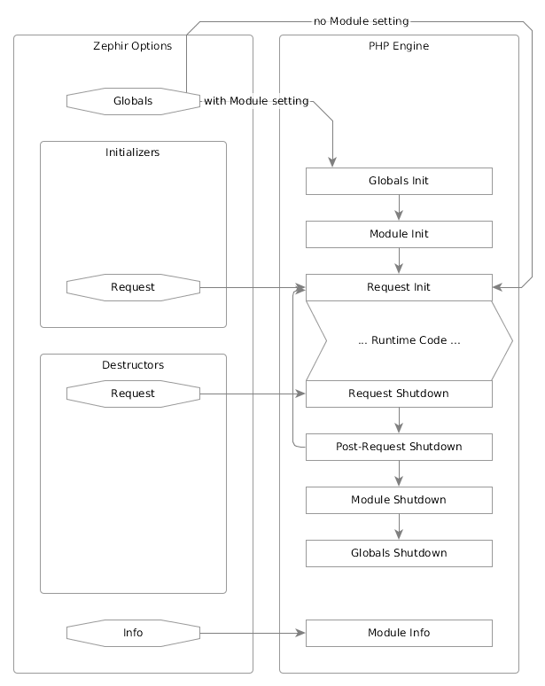

Lifecycle hooks
===============
PHP provides several lifecycle events, which extensions can use to perform common initialization or shutdown tasks. Normally,
Zephir's own hooks into these events will cover all the setup and teardown your extension will need, but if you find that you
need to do something more, there are a few options you can use to pass your own code into these same hooks.

Consider the following diagram:

Lifecycle hooks are registered in the :code:`config.json` file. As you can see in the diagram above, there are two groups of
lifecycle hooks - :code:`initializers` and :code:`destructors`. You can register :code:`include`s and :code:`code` for each
group's supported lifecycle events (just :code:`request` for both, at the moment). The :code:`code` can be whatever you
need/want, but a single function call per hook is recommended, both for clarity in the config, and to keep code in other
files as much as possible.

The :code:`initializers` block looks something like this:

.. code-block:: json

    {
        "initializers": [
            {
                "request": [
                    {
                        "include": "my/awesome/library.h",
                        "code": "some_c_function(TSRMLS_C)"
                    },
                    {
                        "include": "my/awful/library.h",
                        "code": "some_other_c_function(TSRMLS_C)"
                    }
                ]
            }
        ]
    }

And the :code:`destructors` block like this:

.. code-block:: json

    {
        "destructors": [
            {
                "request": [
                    {
                        "include": "my/awesome/library.h",
                        "code": "c_function_for_shutting_down(TSRMLS_C)"
                    },
                    {
                        "include": "my/awful/library.h",
                        "code": "some_other_c_function_than_the_other_ones(TSRMLS_C)"
                    }
                ]
            }
        ]
    }

Support for more of the lifecycle events is planned for a future release.
